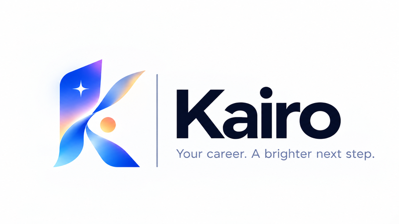
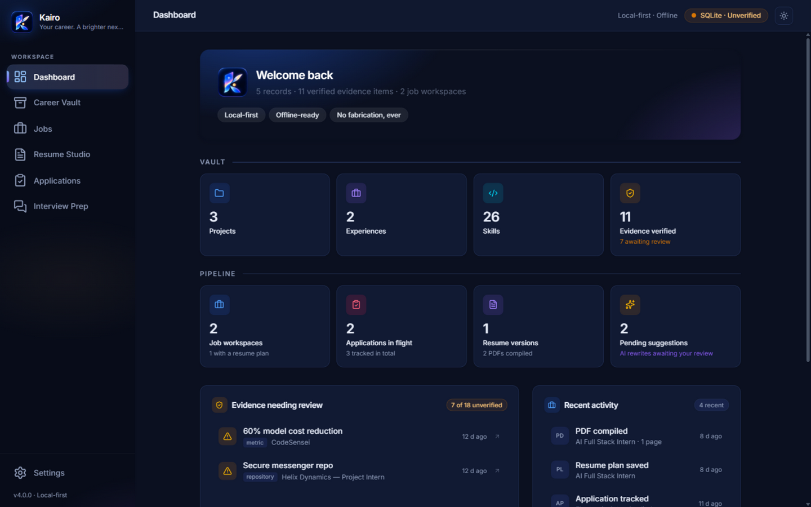
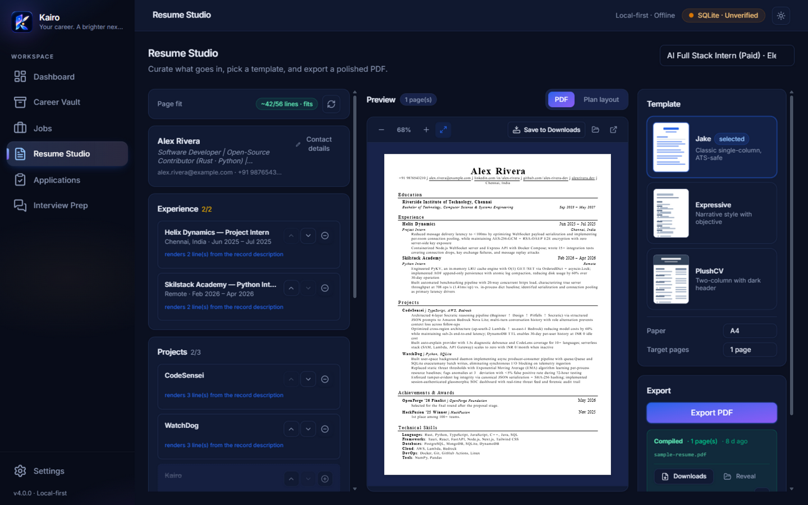

<div align="center">



# Kairo v4

A local-first Windows career intelligence workspace. Store verified career evidence once; for every
opportunity, select the strongest relevant proof, improve the wording without changing the facts,
review every change, and produce a reproducible application artifact.

[](https://github.com/Jeswanth-009/Kairo/actions/workflows/ci.yml)


</div>

---

<p align="center">
  
  
</p>

## Table of contents

1. [The one idea](#the-one-idea)
2. [Product pipeline](#product-pipeline)
3. [Architecture](#architecture)
4. [Data model](#data-model)
5. [Domain modules in detail](#domain-modules-in-detail)
   - [Matching engine](#matching-engine)
   - [Composer — the constraint solver](#composer--the-constraint-solver)
   - [Grounded tailoring + validation pipeline](#grounded-tailoring--validation-pipeline)
   - [JD extraction](#jd-extraction)
   - [Interview prep](#interview-prep)
   - [Imports](#imports)
   - [LaTeX / PDF renderer](#latex--pdf-renderer)
   - [AI provider & local models](#ai-provider--local-models)
6. [Versioning](#versioning)
7. [Frontend](#frontend)
8. [Security model](#security-model)
9. [Testing](#testing)
10. [Hardening](#hardening)
11. [Run](#run)
12. [Building from source](#building-from-source)
13. [Engineering rules](#engineering-rules)
14. [Roadmap](#roadmap)

---

## The one idea

Kairo is **not** an AI resume generator. It is a private career workspace whose source of truth is
your verified history. Three principles govern everything:

1. **No fabrication, ever.** A claim may appear on a resume only if approved evidence supports it.
   Validators reject new metrics, technologies, scale and forbidden phrases — in AI output *and* in
   manual edits (where they're shown as advisory warnings).
2. **Determinism where it matters.** Matching, planning and rendering are pure functions: the same
   database state always produces byte-identical output, asserted by tests.
3. **Human review on every change.** AI suggestions land as *pending*; nothing reaches the resume
   until you press Accept. Imports are *candidates*; nothing enters the Vault without Accept.

The AI layer is **optional**. Matching, planning, rendering and interview prep are deterministic and
work fully offline; only wording tailoring calls a provider, and only if you configure one.

## Product pipeline

Run once per opportunity:

```
  ┌─────────────────────────────────────────────────────────────────┐
  │ CAREER VAULT          projects · experience · education ·       │
  │                       certifications · achievements · skills    │
  │ EVIDENCE              proof attached to claims, verified by you │
  │ CANONICAL BULLETS     approved factual language, evidence-linked│
  └──────────────────────────────┬──────────────────────────────────┘
                                 ▼
  ┌─────────────────────────────────────────────────────────────────┐
  │ JOB WORKSPACE         exact JD stored verbatim                  │
  │ REQUIREMENTS          extracted, then corrected by you          │
  └──────────────────────────────┬──────────────────────────────────┘
                                 ▼
  MATCHING            every requirement → Covered/Partial/Missing
                      weighted relevance across your evidence
                                 ▼
  COMPOSER            deterministic one-page ResumePlan (no AI)
                                 ▼
  TAILORING           optional AI rewording, validated, human-approved
                                 ▼
  RESUME STUDIO       content · editor · live preview
                                 ▼
  PDF                 three ATS-safe LaTeX templates via Tectonic
                                 ▼
  VERSIONS            immutable snapshots — reopen what you sent
                                 ▼
  APPLICATIONS        manual status pipeline per submission
                                 ▼
  INTERVIEW PREP      grounded questions from JD + resume + gaps
```

## Architecture

Four layers, with a hard rule: **pure domain modules never touch the database**. Commands assemble
inputs from persistence, hand them to pure functions, and write results back. This makes every
domain module unit-testable without fixtures and guarantees determinism is testable.

```
┌────────────────────────────────────────────────────────────┐
│ React UI (Tauri 2 + WebView2)                              │
│   features/ pages · components/ui primitives · zustand     │
└──────────────────────────┬─────────────────────────────────┘
                           │ typed invoke() per command
┌──────────────────────────▼─────────────────────────────────┐
│ Tauri command boundary (src-tauri/src/commands/)           │
│   one module per domain; thin: lock → delegate → return    │
└──────────────────────────┬─────────────────────────────────┘
                           │
┌──────────────────────────▼─────────────────────────────────┐
│ PURE DOMAIN MODULES (no DB access)                         │
│   matching.rs · composer.rs · tailor.rs · interview.rs     │
│   jd.rs · imports.rs · latex.rs                            │
└──────────────────────────┬─────────────────────────────────┘
                           │
┌──────────────────────────▼─────────────────────────────────┐
│ PERSISTENCE (src-tauri/src/db/)                            │
│   SQLite (bundled, WAL) · 11 numbered migrations           │
│   entity repos · validators · artifact persistence         │
└────────────────────────────────────────────────────────────┘
```

Long-running work (AI calls, Tectonic compiles) **never holds the SQLite lock** — the lock is
dropped for the duration of the I/O so the UI stays responsive.

## Data model

Eleven numbered migrations, append-only (shipped files are never edited):

| Migration | Tables / changes |
|---|---|
| `0001_init` | `meta` (key/value diagnostics + smoke test) |
| `0002_career_vault` | `profiles`, `projects`, `experiences`, `education`, `certifications`, `achievements`, `skills`, `skill_aliases`, `entity_skills` (confidence 0–5) + cleanup triggers |
| `0003_evidence_trust` | `evidence` (kind, reference, verified), `canonical_bullets`, `bullet_evidence`, `claim_rules` (forbidden/allowed, scoped or global) |
| `0004_jobs` | `jobs` (raw JD verbatim, company, role, seniority, domain), `job_requirements` (kind, text, normalized key, importance, user_confirmed) |
| `0005_match` | `match_results` (coverage, explanation, entity refs per requirement), `match_reports` (full snapshot + weights + engine version) |
| `0006_composer` | `resume_plans` (config JSON + plan JSON + composer version) |
| `0007_tailor` | `tailor_suggestions` (original, suggested, status, validation JSON, model) |
| `0008_pdf` | pdf/tex paths, page count, compiled_at on `resume_plans` |
| `0009_versions` | `resume_versions` (immutable per-job snapshots + private PDF copies) |
| `0010_applications` | `applications` (company, role, status pipeline, next action, notes, job + resume-version links) |
| `0011_artifact_template` | `artifact_template_id` + `artifact_paper` on `resume_plans` (remembers what each compiled PDF used) |

Key relationships:

- `entity_skills` links projects/experiences to skills with a **0–5 confidence** (0 mentioned-only …
  5 production-like). Confidence ≥ 3 counts as *Covered* in matching.
- `canonical_bullets` join `evidence` through `bullet_evidence` — every approved wording lists the
  proof behind it.
- Triggers cascade cleanup: deleting a project removes its evidence, bullets and skill links; link
  rows use `ON DELETE` cascades where the parent is a real FK.

## Domain modules in detail

### Matching engine

`matching.rs` — pure, deterministic, spec §6.

- **Coverage rules.** A skill requirement is *Covered* when the Vault contains the skill (matched by
  canonical name or an explicit alias — never fuzzy) and some project/experience uses it at
  confidence ≥ 3. *Partial* when the skill exists only at low confidence or without project use.
  *Missing* when no Vault skill appears in the requirement at all.
- **Responsibilities** are matched by token overlap against bullets and descriptions; ≥ 50 % wording
  overlap counts as covered experience.
- **The score** ranks *your own* evidence (it is explicitly not a hiring prediction):

  ```
  score = 0.35·required_coverage + 0.20·preferred_coverage + 0.15·responsibilities
        + 0.10·domain + 0.10·recency + 0.10·evidence_strength
  ```

  Coverage is importance-weighted per requirement; recency decays from 1.0 (≤ 1 year) to 0.25
  (≥ 5 years); domain compares the job's domain to your Vault's dominant domain.
- **Entity ranking** orders your projects/experiences by accumulated requirement coverage plus
  confidence and recency bonuses — this ranking feeds the composer.
- **Persistence**: every verdict row plus a full report snapshot (weights + engine version) is
  stored, so old results are auditable.
- **The five spec-mandated tests** are in the suite: alias (JS matches only via alias), missing
  (Kafka stays Missing), recency, evidence-strength, and determinism (byte-identical reports).

### Composer — the constraint solver

`composer.rs` — pure, spec §7. Deterministic: identical inputs produce identical plans.

Config (editable in the Plan tab): `targetPages` (1), `maxProjects` (3), `maxExperienceItems` (2),
`maxBulletsPerItem` (3), `minFontSizePt` (9.5).

Solver sequence:

1. **Reserve mandatory layout** — header and education are selected first and never dropped.
2. **Rank candidates** by match-report relevance, tie-broken by evidence count.
3. **Select records** within caps.
4. **Select bullets** — *approved* canonical bullets only, ranked by how many job requirements each
   one supports (token overlap); take the best `maxBulletsPerItem`.
5. **Estimate cost** — a char/line heuristic (~95 chars/line, 56 lines/page at 10 pt).
6. **Resolve overflow** — drop the lowest-support bullets first, then the lowest-relevance records;
   recompute the estimate after each drop.
7. **Emit** the plan with warnings (caps hit, unapproved bullets excluded, overflow).

The plan references stable Vault IDs; excluded/reordered state lives in the plan JSON and survives
restarts.

### Grounded tailoring + validation pipeline

`tailor.rs` — spec §7.3–7.4.

**The contract.** The model receives *only*: the original bullet, the target requirement(s),
evidence notes, forbidden claim patterns, the list of legal evidence ids, and the Vault skill
vocabulary. It must respond with exactly:

```json
{ "text": "…", "factsUsed": [1], "newClaims": [] }
```

**Parsing** is strict: unknown fields, missing fields, non-empty `newClaims`, empty text, or
non-JSON (after code-fence stripping) are rejected.

**The validation pipeline** runs on every output:

1. **Fact references** — `factsUsed` non-empty and every id maps to real evidence on that record.
2. **Metric diff** — any number in the rewrite absent from the original (fuzzy on leading zeros) is
   rejected: "introduces a new number (5000000)".
3. **Technology diff** — Vault-vocabulary skills appearing in the rewrite but not the original:
   "introduces a new technology (Kubernetes)".
4. **Forbidden scan** — patterns from `claim_rules`, matched case-insensitively on token
   boundaries.
5. **Human review** — passing suggestions land as *pending*; only **Accept** applies them, and even
   then the canonical bullet is untouched — the accepted wording lives on the suggestion row and the
   Studio/Plan render it with a "tailored" badge. **Reject** and **Reset** are one click.

Manual studio edits go through the same validator: the editor shows **live "detected claim
changes"** while you type (advisory — you're the human authority), and each saved edit is stored as
an accepted wording with `model: "manual"`.

### JD extraction

`jd.rs` — pure, heuristic, no AI (spec: "you can begin with rules/keywords").

- Section headings (20+ phrasings: *Requirements, Nice to have, Responsibilities, What you'll
  do…*) switch a line-scanner between required / preferred / responsibility context.
- Bullet lines become one requirement each; "Skills: Python, SQL" lists expand into individual
  entries; dedupe + 40-entry cap.
- Title heuristics: "X at Y", "X — Y" (role keyword detection decides which side is which), labeled
  lines ("Job title:", "Company:").
- Seniority detection (Internship → Leadership) and domain classification (Fintech, Healthcare,
  E-commerce, AI/ML, Infrastructure, Cybersecurity, Data, Gaming) from keyword buckets.
- Headings-less JDs degrade gracefully: bullets become responsibilities.

Everything it produces is a *suggestion* — the review screen (mandatory per spec) lets you
re-classify, reword, add or remove before saving.

### Interview prep

`interview.rs` — pure, deterministic, no invented company-specific patterns (spec §9.4).

Five question categories, each question carrying **"why asked"** grounding and evidence references:

| Category | Source |
|---|---|
| Project deep-dives | Plan entities — "Walk me through X — problem, work, outcome"; features match-ranked records first |
| Technical questions | Required/preferred skills that are *Covered* — depth questions tied to the backing project + evidence |
| Weak areas | *Partial* skills ("where does your experience stop?") and *Missing* ones ("decide how to address the gap") — prioritized preparation targets |
| Behavioral / responsibility | Each responsibility becomes a STAR prompt, grounded by the closest-overlapping experience |
| Resume questions | Internal consistency checks, e.g. plan items with no attached evidence ("how will you back its claims?") |

The command assembles inputs from the stored JD, requirements, match report and plan (preferring
accepted tailored wording), and the page groups results with an "inputs used" summary.

### Imports

`imports.rs` — pure extraction; **nothing touches the database** (architecturally impossible to
auto-save). Three channels, each producing candidate cards with Accept / Edit / Reject / source
preview:

- **Resume text** — section-heading scanner (Projects / Experience / Education / Skills), bullet
  folding into descriptions, "Org — Role" title splitting, contact extraction (email, GitHub,
  website), skill tokenization.
- **GitHub** — public repo metadata + languages + topics from the API (unauthenticated, sanitized
  input) → project candidate with skill suggestions; existing skills link by name/alias, missing
  ones are created on accept.
- **Certificate** — "has successfully completed X" / "Certificate of" title detection, "issued by"
  issuer extraction, month-name and ISO date parsing.

### LaTeX / PDF renderer

`latex.rs` + `db/pdf.rs` — spec §9.1. The LLM is never involved; the renderer owns structure.

- Three **ATS-safe templates** — `jake` (default), `expressive`, `plushcv` — all on the `article`
  class, letter paper, 0.6 in margins, T1 fonts, `hidelinks`, compact itemize, uppercase ruled
  section headings — nothing exotic for parsers to trip on.
- **Full escaping** of every user string: `\ & % $ # _ { } ~ ^`, control characters stripped,
  newlines in descriptions → `\par`. Tested against hostile input.
- **Pipeline**: plan → `.tex` written under `AppData/pdf/job_N/` → `tectonic --outdir --keep-logs` →
  validate (PDF exists, ≥ 500 bytes, page count parsed from the TeX log's "Output written on …
  (N page") → persist paths + page count + timestamp. Tectonic is discovered via a `tectonic_path`
  meta override → `PATH` → `~/.kairo-dev/bin/tectonic.exe`. The compile runs **without the DB
  lock** (first run downloads the whole TeX bundle).

### AI provider & local models

Tailoring (Phase 7) talks to **any OpenAI-compatible endpoint**. Ships with
presets for OpenAI, **Ollama** (`http://localhost:11434/v1`) and LM Studio —
local providers need no API key (none is sent). Settings can fetch the
provider's model list, so pointing Kairo at a local `qwen`, `llama` or `mistral`
model is a three-click setup. The request enforces a JSON contract and the
response passes the same validation gates as cloud models; thinking-model
output (`<think>…</think>`, prose prefixes) is stripped before parsing.

## Versioning

`db/versions.rs` — spec §9.2. Each **Save version** freezes a self-contained snapshot:

- raw JD + reviewed requirement set
- full match report (verdicts, weights, engine version)
- the ResumePlan (with your studio excludes/reorder) + composer config
- all accepted tailored wordings
- matching / composer / template versions
- a **private copy of the compiled PDF** under `pdf/job_N/versions/v_M/` — later recompiles can
  never alter what was sent

Rows are insert-only. The integration test runs this against a copy of the live DB: v1 and v2
created, PDF copied and verified (`%PDF` header), listing newest-first, roundtrip retrieval.

## Frontend

Pages (sidebar): Dashboard · Career Vault · Jobs · Resume Studio · Applications · Interview Prep ·
Settings. Job workspaces live at `/jobs/:id` with the spec §8.2 tab set: Overview · Requirements ·
Match · Plan · Tailor · Resume.

- **Dashboard** — the Phase 13 front page, backed by one read-only `get_dashboard` command:
  live count tiles (records, evidence verified vs awaiting review, job workspaces with/without a
  plan, applications in flight, compiled PDFs, versions, pending suggestions), the unverified
  evidence list with parent-record labels, and a recent-activity feed merged across
  jobs, applications, versions, evidence, bullets and Vault records. No derived scores — every
  number is a query result; a first-run workspace gets a three-step getting-started card instead.

- **Career Vault** — profile card, section tabs with counts, config-driven record dialogs, record
  inspector (Overview / Evidence / Bullets / Claim rules), skills vocabulary with aliases.
- **Job Workspace** — Overview (verbatim raw JD on demand), Requirements (full editing),
  Match, Plan, Tailor, Resume tabs.
- **Resume Studio** — the spec §8.3 three-column workspace:
  - *Content*: include/exclude items and bullets, ↑↓ reorder, constraint indicators
    (`Experience · 1/2`, `1/3 bullets`, amber at cap), Skills card, Header card.
  - *Editor*: canonical bullet vs accepted/AI wording, detected claim changes (live while
    editing), evidence with verified badges, accept / edit / reset.
  - *Preview*: paper-style rendering of exactly what will compile, line estimate vs capacity,
    Export PDF (wired to Tectonic), Save version + versions list.
- Cross-cutting: toasts for completed actions, modals only for destructive/important decisions,
  inline validation first, empty states that say exactly what to do next, `prefers-reduced-motion`
  respected.

State: small Zustand stores (`vaultStore` with evidence/bullet/rule caches, `jobsStore`,
`toastStore`). All Tauri calls flow through one typed module (`src/lib/ipc.ts`).

## Security model

| Risk | Control |
|---|---|
| SQL injection | Parameterized queries only, prepared statements everywhere |
| LaTeX injection | Full escaping of every user string; renderer owns all structure |
| Path traversal | Artifact paths resolved under the app-owned data dir; import names sanitized |
| API key leakage | Windows Credential Manager (keyring) — never SQLite, logs, or plan files |
| Prompt injection in JD text | JD text is treated as data; constraints come from config, not content |
| Unsupported claims | Claim validator + human review on every rewrite and manual edit |
| Over-permissioned app | Minimal Tauri capability set (`core:default` only) |
| Data loss | WAL journaling, atomic artifact copies, immutable version snapshots |

Offline behavior: Vault, matching, planning, rendering, versions and applications work with no
internet. Only tailoring (provider call), first Tectonic run (bundle download) and GitHub import
need connectivity — each degrades with a clear error.

## Testing

116 Rust unit tests across the domain modules + integration tests:

- **Unit** — escaping, section extraction, tokenization, score components, date ordering, alias
  handling, validation gates.
- **The spec's five matching tests** — alias, missing-skill, recency, evidence-strength,
  determinism (byte-identical reports).
- **Composer** — caps, approved-only bullets, overflow ordering, mandatory-section survival,
  determinism.
- **Tailor** — every validation gate, schema violations, fences.
- **Integration** — real plan → real Tectonic → valid 1-page PDF; version snapshots against a copy
  of the live DB (numbering, PDF copy, listing).

Frontend: strict TypeScript (`tsc -b`) + production Vite build as the pre-commit gate.

## Hardening

Phase 14 — the v1 ship pass. Four additions, no schema change:

- **Backup & restore** (`db/backup.rs`). *Create backup* snapshots the whole database through
  SQLite's online backup API (WAL-consistent) into `AppData/backups/kairo-backup-<UTC stamp>.db`,
  verified with `PRAGMA quick_check` before it counts, pruned to the ten most recent. *Restore*
  copies a snapshot back into the live connection — but only after validating the file is a
  healthy SQLite database that actually carries the Kairo schema; garbage or foreign files are
  refused with the live data untouched. Restores re-run migrations, so an older backup upgrades
  transparently. The UI lives in Settings; restore asks for confirmation and reloads the app.
- **Structured logs with redaction** (`logging.rs`). JSON lines in `AppData/logs/kairo.log`,
  rotated to `kairo.log.1` at 1 MB. Any field whose key contains *key/token/secret/password/
  authorization* is redacted before it reaches disk. Long-running commands log ids, model and
  duration — never bullet text, JD content, or API keys.
- **Windows installer.** `npm run tauri build` produces the NSIS setup exe
  (`target/release/bundle/nsis/`).
- **Upgrade tests.** A database migrated only through an earlier release's schema (e.g. 0009)
  upgrades in place: remaining migrations apply in order and pre-upgrade data survives — the same
  contract a restore of an old backup relies on.

Security pass re-verified: all SQL parameterized (dynamic fragments are compile-time column
constants only), full LaTeX escaping, artifacts under the app-owned data dir, restore names
pattern-checked and resolved strictly under `backups/`, API key only in Windows Credential
Manager, Tauri capabilities still `core:default` only, CSP set.

## Download

Grab the signed-off installer for the latest release from
[GitHub Releases](https://github.com/Jeswanth-009/Kairo/releases) — no build
toolchain needed. Note: installers are currently unsigned, so Windows
SmartScreen may ask you to confirm.

## Run

Prereqs: Node 18+, Rust (stable-msvc), Visual Studio Build Tools (C++ workload) and Tectonic.

```bash
npm install
npm run tauri dev        # dev window (vite :5173 + cargo)
npm run build            # frontend type-check + production bundle

cd src-tauri
cargo test               # 116 unit + integration tests
```

In-app quick tour: Settings → AI provider (optional) → Vault (profile + records + evidence +
bullets) → Jobs (paste JD → review requirements) → Match → Plan → Studio (exclude/reorder/edit) →
**Export PDF** → **Save version** → Applications (track it) → Interview Prep.

## Building from source

See [CONTRIBUTING.md](CONTRIBUTING.md) for the full setup (Node, Rust MSVC,
Visual Studio Build Tools, Tectonic) and conventions. The short version:

```bash
npm install
npm run tauri dev        # dev window (vite :5173 + cargo)
```

- `dev.ps1` / `scripts/dev-env.sh` activate a portable MSVC toolchain for
  machines where Visual Studio Build Tools are not on `PATH`; on a normal
  admin install of the Build Tools you don't need them.
- **Tectonic** is auto-discovered from `PATH`; first compile downloads the
  TeX bundle (~100 MB, once).
- Frontend-only UI work can run against fixtures with `npm run dev` →
  `http://localhost:5173/mock.html` (no backend needed).

## Engineering rules

1. **No fabrication, ever.** Every claim traces to approved evidence; validators enforce it for AI
   output and surface it for manual edits.
2. **Determinism is a feature.** Matching, planning and rendering are pure functions with
   byte-identical-output tests.
3. **Never hold the DB lock across I/O.** AI calls and Tectonic compiles run unlocked; a slow
   provider must never freeze the UI.
4. **Migrations are append-only.** Shipped files are immutable; fixes are new numbered files; tests
   assert the applied count.
5. **Imports are candidates, not truth.** Extraction is architecturally incapable of writing to the
   database.
6. **Pure domains, thin glue.** Domain logic never touches the DB or Tauri; commands are
   one-line delegations.

## Roadmap

**v4.1.0 shipped**: one-pass batch tailoring (every planned bullet rewritten in a single
bounded LLM call with a visible Stop control), plan warnings that name the records dropped by
section caps, hardening for reasoning/null-content models, and an open-source readiness pass
(browser-mock import parsers, a self-seeded version-snapshot integration test, zero production
`unwrap()`s, surfaced backup/log I/O warnings, frontend lint + test tooling, community files).
**v4.0.0** shipped the v4 "Midnight Sunrise" brand (official logo system, boot splash,
self-hosted Inter, dark-first theme with an Appearance control), the vault paste crash fix
(char-boundary-safe parsing, async commands, panic containment, ErrorBoundary), and a
reliability sweep. **v3.0.0** shipped ATS-grade PDF export (3 LaTeX templates via Tectonic),
grounded AI tailoring with local-model support (Ollama / LM Studio), deterministic matching and
planning, resume versioning, application tracking, interview prep and backups.

**Next up**: multi-page estimate refinements, deeper frontend test coverage, code-splitting for
faster first paint, resume-version pruning cap, macOS/Linux builds, code signing and the
auto-updater.

Deliberately out of scope (per spec): cloud sync, template marketplace, email tracking,
vector databases, salary/hiring predictions.

## License

MIT — see [LICENSE](LICENSE).
