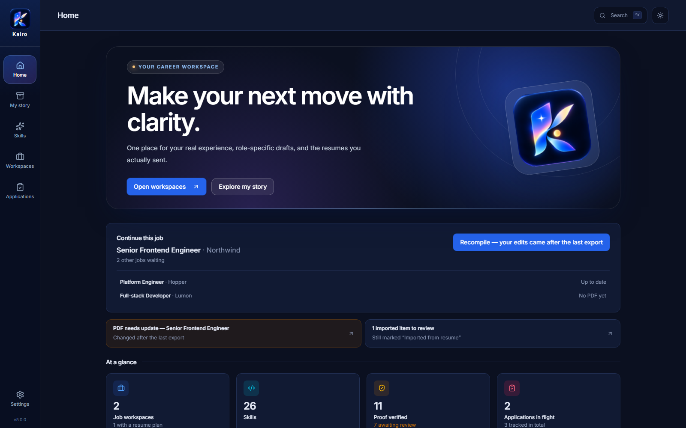
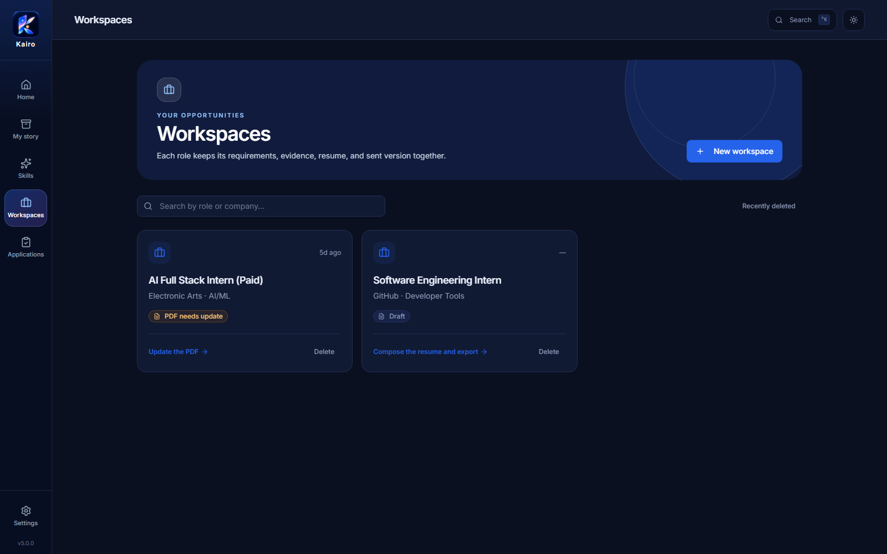

<div align="center">


# Your career story. A clearer next step.

Kairo is a free, open-source desktop workspace for turning your real experience into a focused resume for each role. Review what you import, decide what belongs, inspect the PDF, and remember the version you sent. AI writing is optional.

[Download for Windows](https://github.com/Jeswanth-009/Kairo/releases/latest) · [Website](https://jeswanth-009.github.io/Kairo/) · [Browser demo](https://jeswanth-009.github.io/Kairo/demo/) · [Changelog](CHANGELOG.md)

[](https://github.com/Jeswanth-009/Kairo/actions/workflows/ci.yml)


</div>



## Get started

The [latest release](https://github.com/Jeswanth-009/Kairo/releases/latest) provides a **Windows 10/11, 64-bit installer**. It includes the Tectonic PDF engine. No account or AI provider is required to make a resume.

1. **Bring your history.** Import a text-based PDF or DOCX resume, paste text, or add records manually. Review the extracted facts before saving them. Kairo keeps imported passages with their records so you can check the source later.
2. **Choose a direction.** Create a role workspace from a job description or start a general resume. Review the requirements Kairo extracts. Reopening the same posting returns to its existing workspace.
3. **Choose the evidence.** See which requirements have clear, partial, or missing support from your saved experience. Select records and skills deliberately; edit anything inaccurate.
4. **Make and review the PDF.** Compose and edit the draft in Resume Studio. Re-export after changes, check the actual PDF, then save a reviewed version. When you apply, record the version you sent.

The [browser demo](https://jeswanth-009.github.io/Kairo/demo/) uses sample data to show the interface. It is not the installed desktop app and cannot access your local Kairo database or compile PDFs.

## What is in Kairo 5

| Area              | What it does                                                                                                                                                   |
| ----------------- | -------------------------------------------------------------------------------------------------------------------------------------------------------------- |
| **Home**          | Shows a useful next action and the state of your workspaces.                                                                                                   |
| **My Story**      | Stores profile, experience, projects, education, achievements, source passages, and attached proof.                                                            |
| **Skills**        | Keeps canonical skills and aliases in a separate library. A resume includes only the skills you choose.                                                        |
| **Workspaces**    | Keeps each role's requirements, evidence decisions, resume, PDF, and application together. Repeated imports of the same posting reopen the existing workspace. |
| **Resume Studio** | Lets you select, edit, reorder, and exclude content with a large PDF preview; files and versions are available in a separate panel.                            |
| **AI writing**    | Offers optional bullet rewrites beside the original text. Automated claim checks reject unsupported changes, and you must accept each suggestion.              |
| **Applications**  | Tracks the version actually sent and what happened next.                                                                                                       |



### With or without AI

Import, matching, composition, editing, PDF export, versions, applications, and backups work **without an AI provider**. With an OpenAI-compatible provider, Kairo can suggest bullet wording. A local provider such as Ollama can keep that request on your computer; a remote provider receives the selected role and supporting resume context needed for the suggestion. API keys are stored in the OS credential store.

Automated claim checks help catch unsupported technologies, metrics, and wording. They **cannot guarantee factual accuracy**. Review every suggestion and the final PDF yourself.

### Local-first and reviewable

Career records live in a local SQLite database. Imported facts remain marked as imported until you edit, support, or verify them. Kairo records which saved draft revision produced a PDF; later edits make that PDF out of date. Saving a version requires review of that specific PDF.

## Develop locally

Requirements: **Node.js 20+**, npm, and stable Rust. On Windows, install MSVC C++ Build Tools, or a GNU Rust toolchain with a MinGW linker. CI uses MSVC.

```bash
npm ci
npm run tauri dev
```

`npm run tauri dev` launches the full desktop app. For a browser preview with sample data, run `npm run dev` and open **`http://localhost:5173/mock.html`**. Opening the normal app route in a browser produces a Tauri bridge error because desktop commands are unavailable there.

To build a Windows installer, run `npm run tauri build`; the build script fetches the Tectonic sidecar if needed.

### Checks

```bash
npm run verify                    # lint, frontend tests, type-check, build
cd src-tauri
cargo fmt --check
cargo clippy --all-targets --locked -- -D warnings
cargo test --locked
```

CI runs the Rust checks on Windows, macOS, and Linux. On some local Windows GNU setups, Rust test executables need the comctl32 v6 manifest in `src-tauri/etc/`. A PowerShell example for the library tests:

```powershell
$env:RUSTFLAGS='-C link-arg=C:/path/to/Kairo/src-tauri/etc/tests-manifest.o'
cargo test --locked --lib
```

The Rust integration tests are in `src-tauri/tests/pdf_pipeline.rs` and `src-tauri/tests/versions_flow.rs`.

## Architecture

- **UI:** React 18, TypeScript, Tailwind CSS 4, Vite, and Zustand inside Tauri 2.
- **Core:** Rust commands and domain modules over a 16-migration SQLite schema.
- **PDF:** Tectonic compiles LaTeX templates to a text-based PDF. Draft revisions and artifact fingerprints help identify stale output.
- **AI:** Optional OpenAI-compatible provider. Suggestions pass claim checks and remain subject to human review.
- **Website:** A static landing page in `website/` and a fixture-backed demo, assembled by `scripts/build-site.sh` and deployed through GitHub Pages.

## Current limits

- The official installer is Windows-only. The core is tested on macOS and Linux, but those platforms do not have packaged releases yet.
- PDF import needs a text layer. Scanned PDFs need OCR elsewhere or manual entry.
- Matching shows support from your stored records; it does not predict hiring outcomes.
- Automated claim checks cannot establish that your source records or accepted wording are true.

## Contribute

See [CONTRIBUTING.md](CONTRIBUTING.md) for setup and the code map. Bug reports, focused improvements, accessibility fixes, parser cases, and documentation are welcome. Security issues should follow [SECURITY.md](SECURITY.md).

Kairo is [MIT licensed](LICENSE).
