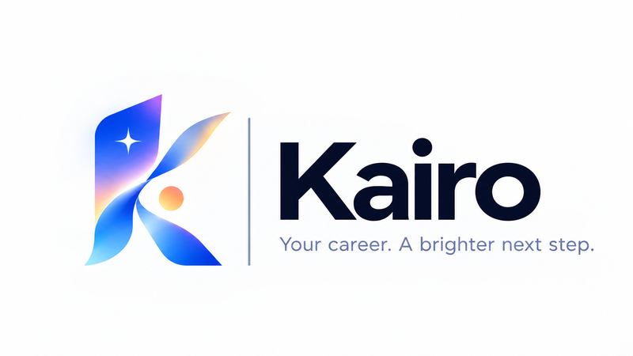

<div align="center">



# Kairo

A local-first career workspace that turns your existing resume into a reviewed, relevant PDF for a specific role — with every recommendation explained and every claim traceable to your confirmed history.

[](https://github.com/Jeswanth-009/Kairo/actions/workflows/ci.yml)


</div>

---

## What Kairo does

Kairo keeps your career history — projects, experience, education, skills, achievements — as
**reviewable, verifiable facts** in a local SQLite database (the *My Story* library). For each
job you target, it builds a tailored resume from those facts:

1. **Import** an existing resume (PDF / DOCX / pasted text) — extracted facts are grouped for
   your review; nothing is trusted automatically.
2. **Add a role** — paste the job description; confirm the requirements that matter.
3. **See the evidence** — Kairo matches your confirmed history against each requirement and
   explains *why* a record was selected, with clear / partial / missing support — never a
   hiring-probability score.
4. **Review the exact PDF** — the compiled document is shown with a checklist; saving a
   version requires you to have reviewed that specific revision.
5. **Track the application** — which version you sent, when, and what happened next.

The interface is organised around these goals:

| Destination | Purpose |
|---|---|
| **Home** | Continue the most important unfinished action |
| **Jobs** | Manage each role and its tailored resume |
| **My Story** | Review and improve reusable career history |
| **Applications** | Track what was submitted and what happened |
| **Settings** | Appearance, AI provider, backups, diagnostics |

Interview prep lives inside each job workspace, because its questions depend on that job.

## Design principles

- **No fabrication, ever.** Every resume line traces back to a confirmed fact; AI-suggested
  rewrites are validated against your evidence and require explicit acceptance.
- **Honest provenance.** Imported facts are labelled *Imported from resume* until you edit
  (*Edited by you*), attach evidence (*Evidence attached*), or explicitly verify them
  (*Verified by you*). Verification is always a deliberate human act.
- **Explainable selection.** The composer shows why each record was chosen — the matched
  requirement, the source record, and the strength of support.
- **Local-first.** Your data stays in a local SQLite database. AI is optional and
  clearly separated; without a provider, everything except wording suggestions works.
- **Reviewable PDFs.** Export is revision-checked: the PDF matches a specific saved draft,
  and edits after the export make the PDF visibly out of date.

## Supported platforms

- **Windows 10/11** (NSIS installer; Tectonic sidecar bundled).
- macOS and Linux: the Rust core and frontend are cross-platform, but packaging and
  the Tectonic sidecar are currently Windows-first.

## Getting started (5 minutes)

1. Install Node.js **20+** and Rust (stable, MSVC toolchain on Windows).
2. `npm install`
3. `npm run tauri dev` — the app launches; a blank slate opens the guided first-run flow:
   bring an existing resume, confirm the extracted facts, paste one job description, and
   get a reviewable PDF in one sitting.
4. For production builds: `npm run tauri build` (requires the Tectonic sidecar —
   `npm run ensure-tectonic` fetches it, or the build script does automatically).

## Development

```bash
npm install
npm run dev          # frontend only (browser, with mock data)
npm run tauri dev    # full desktop app

npm run verify       # lint + test + build — the pre-push gate
npm test             # vitest only
cargo test           # Rust tests (in src-tauri; needs the MSVC environment on Windows)
cargo clippy --all-targets -- -D warnings
```

On Windows, `scripts/dev-env.sh` (bash) or `dev.ps1` sets up a portable MSVC toolchain for
the bundled SQLite build. CI runs the same checks on Windows, macOS and Linux.

### Architecture (short version)

- **Frontend:** React 18 + TypeScript + Tailwind v4 + Vite; zustand stores; Tauri IPC.
- **Backend:** Rust (Tauri 2) with a domain-module layout — matching, composer, tailor,
  imports — over a 15-migration SQLite schema (WAL, foreign keys, soft-delete trash,
  artifact fingerprints, record provenance).
- **PDF:** headless Tectonic (LaTeX) compilation in a staging directory with atomic
  promotion — an interrupted export leaves the previous PDF intact.
- **Trust model:** every record carries origin/edited/verified provenance; evidence links
  back claims to proof; AI rewrites pass a validation pipeline that rejects fabricated
  technologies, metrics and uncited claims.

## Honest limitations

- Windows-first packaging; macOS/Linux are buildable but not installer-ready.
- Resume PDF extraction handles text-based PDFs; scanned/image exports need pasted text.
- Correction history per record and automatic stale-PDF marking on fact changes are
  planned but not implemented — records show `edited` timestamps and usage counts instead.
- AI features require an OpenAI-compatible provider (OpenAI, Groq, a local Ollama server);
  Kairo works fully without them.

## Contributing

Good first tasks: additional resume-parser patterns (see `src-tauri/src/imports.rs` tests),
frontend test coverage for the onboarding flow, and dark-theme contrast passes. Run
`npm run verify` before pushing — CI runs the same checks plus the Rust suite on three
platforms.
